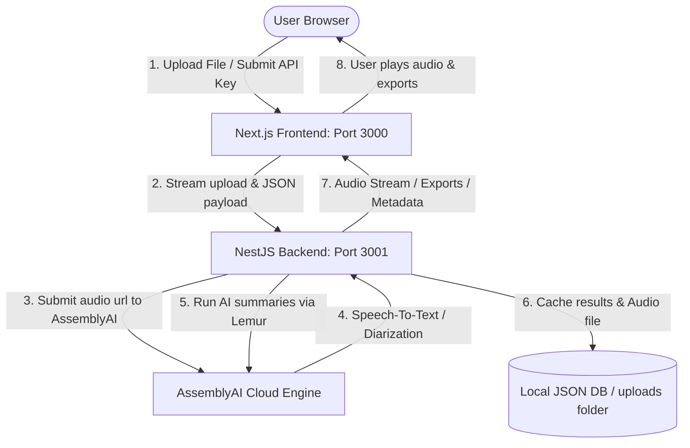

# 🎙️ Transcribe App

A state-of-the-art, premium AI-powered Transcription & Analysis Workspace. It enables users to upload audio/video recordings, transcribe them with high accuracy using AssemblyAI (with automatic speaker diarization), edit speaker names, analyze discussions using AI-generated summaries and chapters, and export structured dialogues into professional **PDF, DOCX, XLSX, SRT, VTT, and TXT** formats.

---

## ✨ Features

- **🌐 Highly Accurate AI Transcription:** Backed by AssemblyAI's latest `universal-3-pro` and `universal-2` models for superb multi-lingual speech-to-text accuracy (including full Russian/Cyrillic support).
- **👥 Intelligent Speaker Diarization:** Automatically identifies different speakers in the conversation and allows renaming them globally throughout the transcript.
- **🔊 Smart Interactive Audio Player:** 
  - Syncs the playback progress bar with the transcript.
  - Clicking any word or chronological chapter instantly seeks the audio to that exact timestamp.
  - Fully robust: seamlessly streams real audio from the backend, and automatically falls back to a simulated silent playback if the physical file is unavailable (e.g. for historic entries).
- **📝 AI Summaries & Chapters (AssemblyAI Lemur):** Generates structured Executive Summaries, Key Takeaways, Action Items, and interactive chronological Chapter breakdowns.
- **📊 Professional Exporters:**
  - **XLSX (Excel):** Generates structured cells dividing speaker, timestamp, and dialogue.
  - **DOCX (Word):** Creates structured tables with borders, clear headers, and custom typography.
  - **PDF:** Outputs a beautifully formatted document with premium styling, margins, page numbers, and embedded font support ensuring Cyrillic text renders properly without encoding glitches.
  - **SRT / VTT / TXT:** Standard subtitle files and raw timestamped scripts.
- **🎨 Elite Dark Mode Design:** Sleek modern interface utilizing vibrant gradients, glassmorphism, glowing micro-animations, and fluid transitions.

---

## 🛠️ Technology Stack

### Frontend
- **Framework:** Next.js (App Router)
- **UI Components:** Material UI (MUI v5)
- **Styling:** Styled-components & Vanilla CSS
- **Icons:** Material Icons

### Backend
- **Framework:** NestJS (TypeScript)
- **Database:** Local JSON-based persistent storage (for configuration and transcript metadata)
- **Media Ingestion:** Multer (with support for massive uploads up to 2GB)
- **Export Engines:** `pdfkit` (PDF generation), `docx` (Word templates), `exceljs` (Excel structuring)
- **Third-Party AI Integration:** AssemblyAI Node.js SDK (Transcripts & Lemur endpoints)

---

## 🚀 Installation & Launch Guide

### 📋 Prerequisites
Ensure you have **Node.js** (v18 or higher) and **npm** installed on your machine.

### 🏃 Quick Start (All-in-one command)

1. Clone or open the project folder in your terminal.
2. Install all dependencies for the workspace, backend, and frontend:
   ```bash
   npm run install-all
   ```
3. Create local environment files and configure SMTP:
   ```bash
   cp backend/.env.example backend/.env
   cp frontend/.env.example frontend/.env
   ```
   On Windows PowerShell, use `Copy-Item` instead of `cp`. Set a real SMTP server in `backend/.env`; registration sends an email verification link.
4. Start both the NestJS backend and Next.js frontend concurrently in development mode:
   ```bash
   npm run dev
   ```
5. Open your browser and navigate to:
   * **Frontend Application:** [http://localhost:3000](http://localhost:3000)
   * **Backend REST API:** [http://localhost:3001](http://localhost:3001)

### Environment and deployment

Backend authentication variables:
- `JWT_SECRET`: long random signing secret; mandatory when `NODE_ENV=production`.
- `ALLOWED_EMAILS`: optional comma-separated list of exact additional addresses. Matching is case-insensitive.
- `FRONTEND_URL`: public frontend URL used in verification links.
- `SMTP_HOST`, `SMTP_PORT`, `SMTP_SECURE`, `SMTP_USER`, `SMTP_PASSWORD`, `SMTP_FROM`: SMTP transport settings.
- `COOKIE_DOMAIN`: optional shared cookie domain; leave empty for host-only cookies.
- `CORS_ORIGIN`: one or more comma-separated frontend origins.

Frontend uses `NEXT_PUBLIC_BACKEND_URL`. Do not put secrets in any `NEXT_PUBLIC_*` variable.

The deployment workflow reads complete environment files from GitHub secrets `ENV_FILE_BACKEND` and `ENV_FILE_FRONTEND`. Add the variables above to those secrets; their values are not printed by the workflow.

---

## 📖 How to Use the App

### 👤 1. Register and verify your email
- Addresses under `f-suite.com` and `qirelab.com` are allowed automatically.
- Additional exact addresses can be added to the comma-separated backend variable `ALLOWED_EMAILS`.
- Open the verification link sent by SMTP, then log in. Each account sees only its own transcripts and media.

### 🔑 2. Setup API Key
After login, if no shared AssemblyAI key is configured, you will be greeted by the **Setup Screen**.
- Paste your **AssemblyAI API Key** (you can obtain one from the [AssemblyAI Dashboard](https://www.assemblyai.com/)).
- Click **Save & Continue**. This configures the key on your local backend.

### 📤 3. Upload Audio or Video
- Drag and drop or browse any audio/video file (e.g., `.mp3`, `.wav`, `.m4a`, `.mp4`, `.avi`) into the glowing **Dashboard Upload Area**.
- The app handles large files up to 2GB. 
- While the background task processes the speakers, timestamps, and AI Lemur insights, you can watch the interactive progress shimmer.

### 👥 4. Rename Speakers
- Once transcription completes, click on any speaker's badge (e.g., `Speaker A`) in the workspace.
- A popup prompt will appear. Enter their actual name (e.g., `Director`, `Alex`) and submit.
- The name updates **instantly** throughout the entire dialogue, search list, and exported files!

### 🎯 5. Interactive Navigation & Playback
- Click the **Play** button on the floating audio player bar at the bottom.
- Click **any individual word** or **chronological chapter** in the sidebar to jump exactly to that moment in the recording.
- Use global keyboard shortcuts: Press **Spacebar** to toggle play/pause from anywhere on the page.

### 💾 6. Export Your Dialogues
- Click the **Export** dropdown button in the top right of the workspace.
- Choose your preferred format:
  - **Word Document (.docx)** or **Excel Spreadsheet (.xlsx)** for perfectly structured, cell-separated conversation grids.
  - **PDF Document (.pdf)** for a presentation-ready printed report.
  - **SRT/VTT/TXT** for subtitle streams.

---

## 📸 Screenshots & Architecture Walkthrough



### 📱 User Interface Highlights

#### 🌌 Dashboard & Uploader
*An ultra-modern, glassmorphic drag-and-drop landing area with custom neon glow hover effects, encouraging intuitive uploads.*

#### 🎛️ Transcript Workspace
*Split-screen layout:*
* **Left Sidebar:** Document Library and history records showing status badges.
* **Main Center Workspace:** The timestamped dialogues with glowing word-highlighting synced with the active audio stream.
* **Right Sidebar:** Summary tabs displaying the AI Executive Summary, Gist, and Action Items.

#### 🎵 Floating Audio Player
*A state-of-the-art bottom-anchored control bar containing playback toggles, skip buttons, standard slider scrubbing, volume controls, and responsive visualizer nodes.*

---

## 🧹 Maintenance & Cleanup

To keep your workspace storage tidy, clicking the **Delete (Bin)** icon on any document in the history sidebar will globally:
1. Purge the record metadata from the local database.
2. Permanently delete the stored audio/video playback cache file from the server's `./uploads/` directory.
